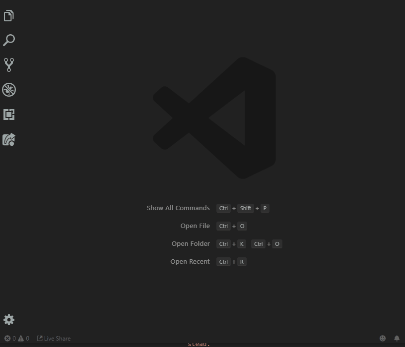
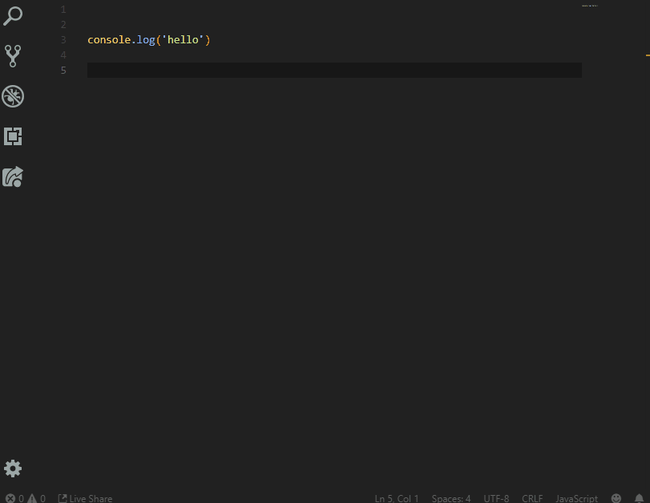

# VSCord for Visual Studio Code

This extension adds some common snippets and a few other tools to make discord bot development a bit easier.

# Features

## Discord.py

- Support for all events
- Basic bot framework with support for commands

- Basic extension file creation for cogs
- Docstrings 

## Discord.js

- Support for all events
- Basic bot framework with support for commands

## Tools

- `Install Discord API Library`

- Run JS files from context menu

# Known Issues

- Let me know and I'll see what I can do.

# Release Notes

- This extension has only been tested on Windows 10

### 0.5.0

Test release of VSCord

